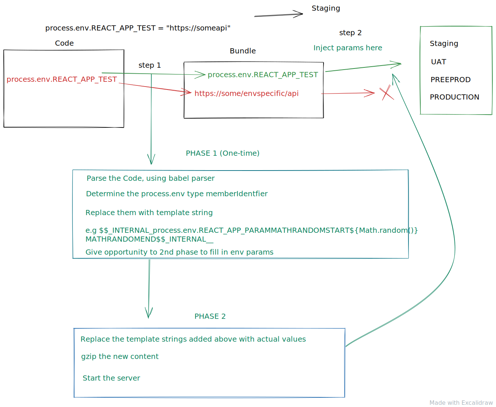

# envvarprep-loader

<h2  align="center"A webpack loader which prepares the builds to allow env injection later on without building everything again.</h2>

### Usage

```sh

yarn add envvarprep-loader --dev

```

```javascript
module: {
      rules: [
        {
          test: /\.(js|mjs|jsx|ts|tsx)$/,
          enforce: 'pre',
          include: path.join(__dirname, './src'),
          use: [
            {
              options: {
                exclude: ['NODE_ENV', 'REACT_APP_APPNAME', 'PUBLIC_URL'],
                plugins: ['jsx'],
                enable: true,
                debug: true, // default is false
              },
              loader: "envvarprep-loader",
            }
          ],
          exclude: /(node_modules|dist)/,
        },
      ],
```

Types for loader options

```typescript
interface IOptions {
  exclude?: string[];
  plugins?: ParserPlugin[];
  enable?: boolean;
  debug?: boolean;
  sourceType?: ParserOptions['sourceType'];
}
```

> Make sure the envvarprep-loader gets the opportunity to first transform the code before any other loader. So place it at the last index of use array. The last loader is executed first [Read the info at webpack](https://webpack.js.org/contribute/writing-a-loader/#complex-usage)

### Process to inject env to the built files

Only replacing process env with the placeholder text will not work. We need a mechanism to inject the param values also.

We provide a default injection scripts , which will work in most of the cases. For very specific and customized build processes, one can checkout the injectEnv.tsx in the codebase and implement their owns.

```javascript
import { injectEnv } from 'envvarprep-loader';
```

### Usage

```javascript
const env = {
  REACT_APP_PARAM_TWO: 'I am param two',
  REACT_APP_PARAM_THREE: 'I am param three',
};
const payload = {
  globOptions: {
    cwd: `${__dirname}/injectEnvInputFolder`,
  },
  pattern: '*.js?(.map)',
  envVar: env,
  debug: true,
  destination: `${__dirname}/injectEnvInputFolder/output`,
  updateInline: false,
};
injectEnv(payload);
```

> envvarprep-loader is written using typescript, so type suggestion can be used to make use of the loader and helper function

#### injectEnv Options

```typescript
interface IEnvObj {
  [key: string]: string;
}

interface IInjectEnv {
  globOptions: glob.IOptions;
  envVar?: IEnvObj;
  debug?: boolean;
  destination?: string;
  pattern?: string;
  updateInline?: boolean;
}
```

### Default values

```javascript
const defaultOptions = {
  globOptions: {
    cwd: __dirname,
  },
  pattern: '*',
  envVar: {},
  debug: process.env.NODE_ENV !== 'production',
  destination: __dirname,
  updateInline: true,
};
```

globOptions: All the options which are accepted by (Glob)[https://www.npmjs.com/package/glob]

pattern:string [optional] glob pattern string (see the pattern in section)[https://www.npmjs.com/package/glob#globsyncpattern-options]

envVar(object): Env objects that is fetched from any other param store.

debug:boolean[optional]: (default is dependent in process.env.NODE_ENV !== 'production').

destination:string [optional]: A destination where you want to put the updated files. By default if updateInline is not passed , the original files will be updated. This is what will be needed most of the times

updateInline: if true (default), the original files will be updated.

### How it works

<p align="center"></p>

Image explians all what is happening with the loader and script.

Built with [TSDX](https://github.com/jaredpalmer/tsdx)
