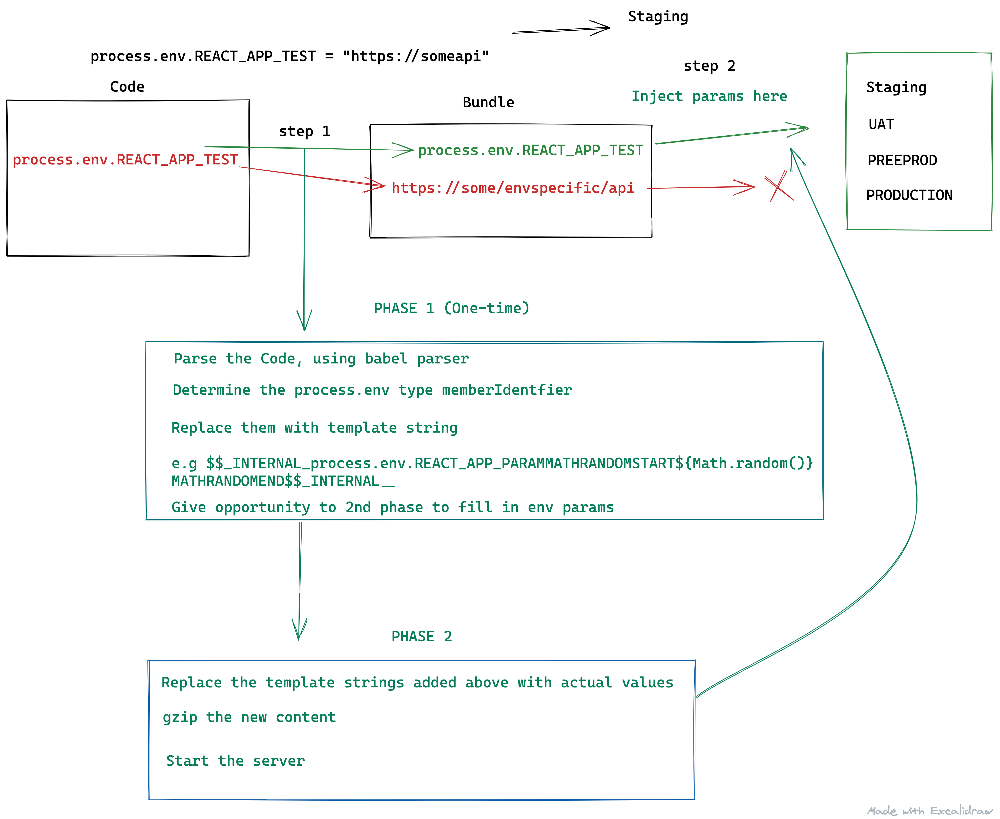

# envvarprep-loader

<h2  align="center">A webpack loader which prepares the frontend builds to allow env injection later on without building everything again.</h2>

<p  align="center">


</p>

### Usage

```sh
yarn add envvarprep-loader --dev

```

```javascript

module: {
  rules: [
    {
      test: /\.(js|mjs|jsx|ts|tsx)$/,
      enforce: 'pre',
      include: path.join(__dirname, './src'),
      use: [
        {
          options: {
            exclude: ['NODE_ENV', 'REACT_APP_APPNAME', 'PUBLIC_URL'],
            plugins: ['jsx'],
            enable: true,
            debug: true, // default is false
          },
          loader: "envvarprep-loader",
        }
      ],
      exclude: /(node_modules|dist)/,
    },
  ],
}
```

Types for loader options

```typescript
interface IOptions {
  exclude?: string[];
  plugins?: ParserPlugin[];
  enable?: boolean;
  debug?: boolean;
  sourceType?: ParserOptions['sourceType'];
}
```

> Make sure the envvarprep-loader gets the opportunity to first transform the code before any other loader. So place it at the last index of use array. The last loader is executed first [Read the info at webpack](https://webpack.js.org/contribute/writing-a-loader/#complex-usage)

### Process to inject env to the built files

Only replacing process env with the placeholder text will not work. We need a mechanism to inject the param values also.

We provide a default injection scripts , which will work in most of the cases. For very specific and customized build processes, one can checkout the injectEnv.tsx in the codebase and implement their owns.

```javascript
import { injectEnv } from 'envvarprep-loader';
```

### Usage

```javascript
const env = {
  REACT_APP_PARAM_TWO: 'I am param two',
  REACT_APP_PARAM_THREE: 'I am param three',
};
const payload = {
  globOptions: {
    cwd: `${__dirname}/injectEnvInputFolder`,
  },
  pattern: '*.js?(.map)',
  envVar: env,
  debug: true,
  destination: `${__dirname}/injectEnvInputFolder/output`,
  updateInline: false,
};
injectEnv(payload);
```

> envvarprep-loader is written using typescript, so type suggestion can be used to make use of the loader and helper function

#### injectEnv Options

```typescript
interface IEnvObj {
  [key: string]: string;
}

interface IInjectEnv {
  globOptions: glob.IOptions;
  envVar?: IEnvObj;
  debug?: boolean;
  destination?: string;
  pattern?: string;
  updateInline?: boolean;
}
```

### Default values

```javascript
const defaultOptions = {
  globOptions: {
    cwd: __dirname,
  },
  pattern: '*',
  envVar: {},
  debug: process.env.NODE_ENV !== 'production',
  destination: __dirname,
  updateInline: true,
};
```

globOptions: All the options which are accepted by [Glob](https://www.npmjs.com/package/glob)

pattern:string [optional] glob pattern string [see the pattern in section](https://www.npmjs.com/package/glob#globsyncpattern-options)

envVar(object): Env objects that is fetched from any other param store.

debug:boolean[optional]: (default is dependent in process.env.NODE_ENV !== 'production').

destination:string [optional]: A destination where you want to put the updated files. By default if updateInline is not passed , the original files will be updated. This is what will be needed most of the times

updateInline: if true (default), the original files will be updated.

### Problem statement:

```
So in typical organisation, we generally have many environment for various
stateholders e.g dev, staging, uat, preproduction and production. We keep secret keys in some kind of param store which varies across environment. When we need to deploy same code on different environment we need to rebuild everything, even if the code remains same, only the secrets might have changed. We need not repeat whole npm install, production build and other processes which are common. we can reuse the built code and inject secrets in later steps(which will only care for changed param values not other things). This usual build process may be okish for some projects, where build process is itself very minute. But in most of the projects the build takes 5-10 minutes. The process I mentioned above can bring the time within 1 minutes.
Think about time and money that can be saved in a organization having multiple projects.


How this will done ?

I will be making use babel ASTs , babel parsers and webpack loaders to do so. These tools can be used to give us an extra step where we can inject secrets.

```

### How it works

<p align="center"></p>

Image explains all what is happening with the loader and script.

Know Issues:

- Syntax like below will not work as expected.

```javascript
const { env } = process;
const { REACT_APP_PARAM_TWO } = env;
console.log('REACT_APP_PARAM_TWO HI ', REACT_APP_PARAM_TWO);
```

Improvements:

- Only for non .js file, we do env injection with string replacement. For .js files we make use of babel ast transformation (which cover almost all the usecases). Need to look for solution for other types of file .js.map files. Any prs and discussions are welcome !!.

* Make use of some babel plugin to remove the dead code in the second phase. As env injection might evaluate certain code blocks to be unnecessary. Doing that
  should bring in the same bundle size which happens otherwise now.

Built with [TSDX](https://github.com/jaredpalmer/tsdx)
